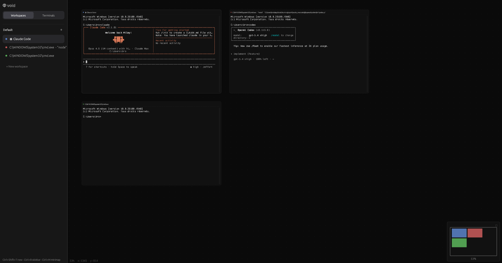

# Void


<!--[](LICENSE)
[](https://www.rust-lang.org)
[](#)
[-blueviolet)](#)-->

[Void](https://void.sh) is an infinite canvas terminal emulator — GPU-accelerated, cross-platform. No tabs, no splits, no tiling — just an infinite 2D surface where you place terminals anywhere with pan and zoom navigation.

- Infinite 2D canvas where you place terminals anywhere
- GPU-accelerated 60fps rendering via wgpu (Vulkan, Metal, DX12)
- Real terminal emulation powered by alacritty_terminal (ANSI/VT100, 256-color, truecolor)
- Workspaces, command palette, minimap, keyboard-first design



## Getting Started

Download the latest binary for your platform from the [Releases](https://github.com/190km/void/releases) page — no build step required.

> Built **entirely in Rust**. Zero web technologies. No Electron, no WebView, no JavaScript runtime. Native performance via wgpu.

## How It Works

```
  You ──► Infinite Canvas (pan/zoom) ──► Terminal Panels (drag/resize anywhere)
              GPU-rendered (wgpu)              ↕
                                          alacritty_terminal + portable-pty
                                              ↕
                                          Real shell (bash, zsh, powershell, ...)
```

Each terminal panel is an independent PTY process rendered onto the canvas via the GPU. Panels can be freely dragged, resized, and arranged in any spatial layout you want. Zoom out to see everything, zoom in to focus.

## Features

| | |
|---|---|
| **Infinite Canvas** | Pan, zoom, and place terminals anywhere on a boundless 2D surface |
| **GPU Accelerated** | 60fps rendering via wgpu — Vulkan, Metal, and DX12 backends |
| **Real Terminal Emulation** | Powered by alacritty_terminal — full ANSI/VT100, 256-color, truecolor |
| **Workspaces** | Independent canvas views for different contexts, each with their own layout |
| **Command Palette** | `Ctrl+Shift+P` — fuzzy search across all actions |
| **Minimap** | Bird's-eye overview of your entire terminal layout |
| **Keyboard-First** | Every action reachable without a mouse |
| **Cross-Platform** | Windows, Linux, macOS |

## Keyboard Shortcuts

| Action | Shortcut |
|---|---|
| New terminal | `Ctrl+Shift+T` |
| Close terminal | `Ctrl+Shift+W` |
| Command palette | `Ctrl+Shift+P` |
| Rename terminal | `F2` |
| Focus next / prev | `Ctrl+Shift+]` / `[` |
| Toggle sidebar | `Ctrl+B` |
| Toggle minimap | `Ctrl+M` |
| Toggle grid | `Ctrl+G` |
| Zoom in / out | `Ctrl+=` / `-` |
| Reset zoom | `Ctrl+0` |
| Fit all terminals | `Ctrl+Shift+0` |
| Pan canvas | Middle-click drag / Scroll |
| Zoom | `Ctrl+Scroll` / Trackpad pinch |

## Architecture

```
src/
├── app.rs              # main application loop
├── canvas/             # pan, zoom, viewport math, minimap, grid
├── terminal/           # panel rendering, PTY management, input handling
├── sidebar/            # workspace list, session list, quick actions
├── command_palette/    # fuzzy search, command registry
├── state/              # workspace & panel state management
├── theme/              # color palette, fonts
├── config/             # schema, defaults, hot-reload
├── shortcuts/          # keybinding system
└── utils/              # ids, platform detection
```

**Stack:** [eframe](https://github.com/emilk/egui/tree/master/crates/eframe) + [egui](https://github.com/emilk/egui) + [wgpu](https://github.com/gfx-rs/wgpu) + [alacritty_terminal](https://github.com/alacritty/alacritty) + [portable-pty](https://github.com/wez/wezterm/tree/main/pty)

## Roadmap

- [x] Infinite canvas with pan/zoom
- [x] GPU-accelerated rendering (wgpu)
- [x] Real terminal emulation (alacritty_terminal + portable-pty)
- [x] Multiple terminals with independent PTY processes
- [x] Full ANSI color support (16, 256, truecolor)
- [x] Workspaces with viewport persistence
- [x] Command palette with fuzzy matching
- [x] Minimap navigation
- [x] Panel drag, resize, close, rename, focus cycling
- [x] Layout persistence (save/restore on quit)
- [x] Snap guides for panel alignment
- [x] Smart panel positioning (gap-filling algorithm)
- [x] Resize snap with virtual accumulation (escape snap zones naturally)
- [x] Terminal input: Ctrl+Backspace, Ctrl+Delete, modifier-aware F-keys
- [x] Extensible panel system (CanvasPanel enum)
- [x] Canvas configuration constants (centralized tuning)
- [x] Auto-update checker with silent install
- [ ] Session restore (reopen terminals with CWD + scrollback)
- [ ] Configuration hot-reload (TOML)
- [ ] Auto-layout engine (tidy, arrange)
- [ ] Built-in theme engine + custom themes
- [ ] Embedded webviews (CEF/Servo offscreen rendering)
- [ ] Plugin system

See [STATUS.md](STATUS.md) for detailed progress and [PRD.md](PRD.md) for the full roadmap.

## Contributing

Void is open source and contributions are welcome.

1. Clone the repository

```bash
git clone https://github.com/190km/void.git
cd void
```

2. Make sure you have the Rust toolchain installed ([rustup.rs](https://rustup.rs))

3. Run in dev mode and hack away

```bash
cargo run
```

4. Check before submitting

```bash
cargo clippy --all-targets --all-features -- -D warnings
cargo fmt --check
cargo test
```

See [RELEASING.md](RELEASING.md) for the Linux, macOS, and Windows release flow.

If you find a bug or have a feature request, [open an issue](https://github.com/190km/void/issues).

## Star History

<a href="https://www.star-history.com/?repos=190km%2Fvoid&type=timeline&legend=top-left">
 <picture>
   <source media="(prefers-color-scheme: dark)" srcset="https://api.star-history.com/image?repos=190km/void&type=timeline&theme=dark&legend=top-left" />
   <source media="(prefers-color-scheme: light)" srcset="https://api.star-history.com/image?repos=190km/void&type=timeline&legend=top-left" />
   
 </picture>
</a>

## License

[MIT](LICENSE) — 190km
